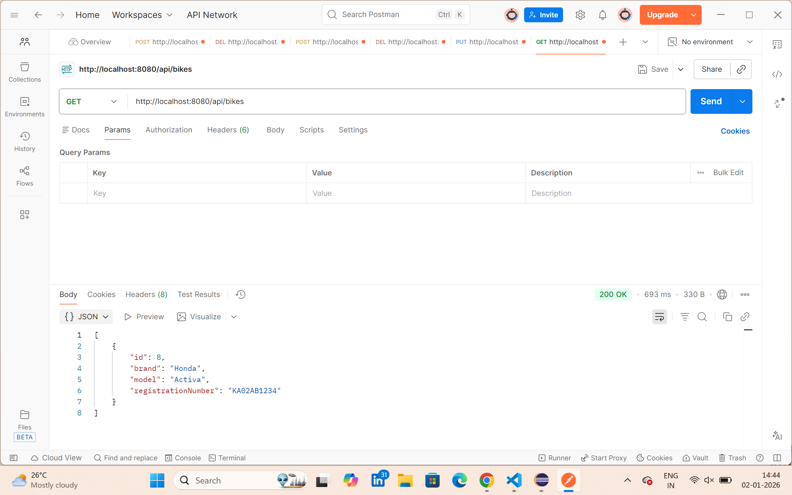
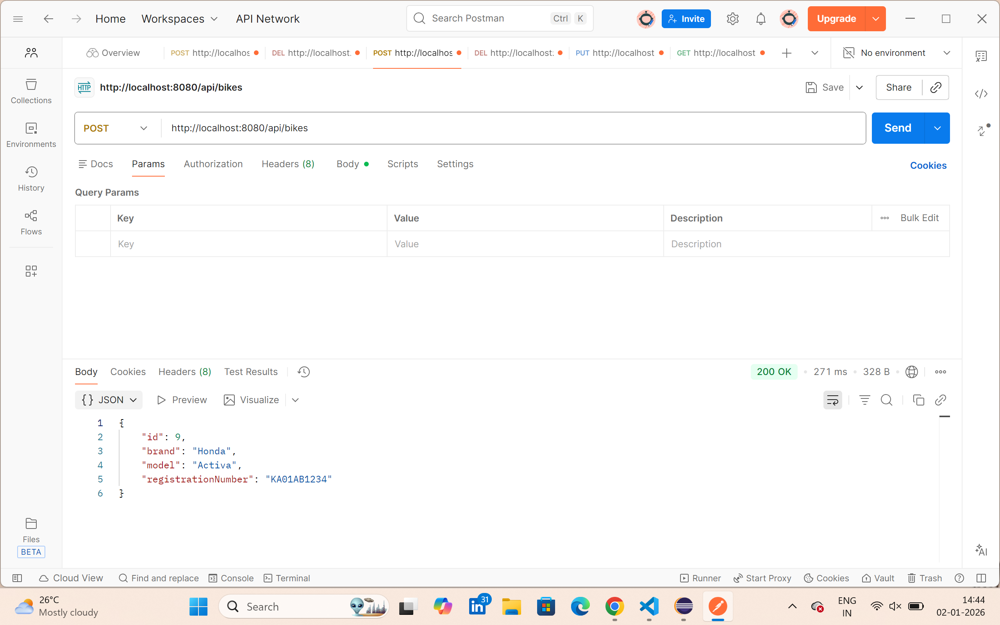
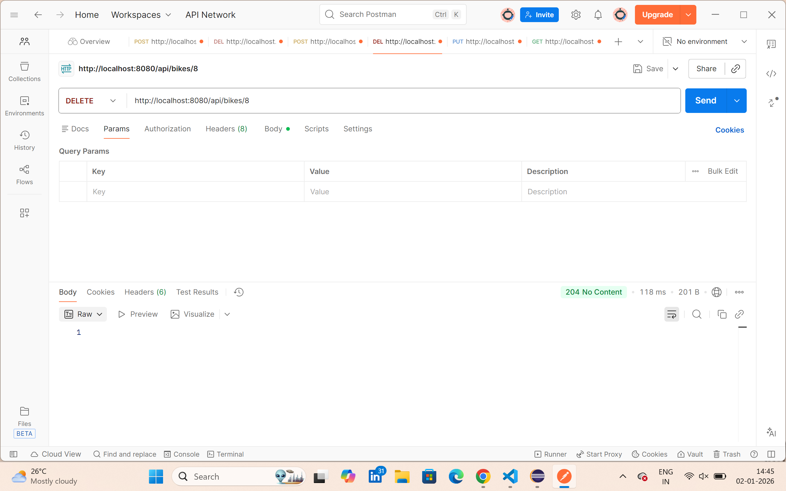
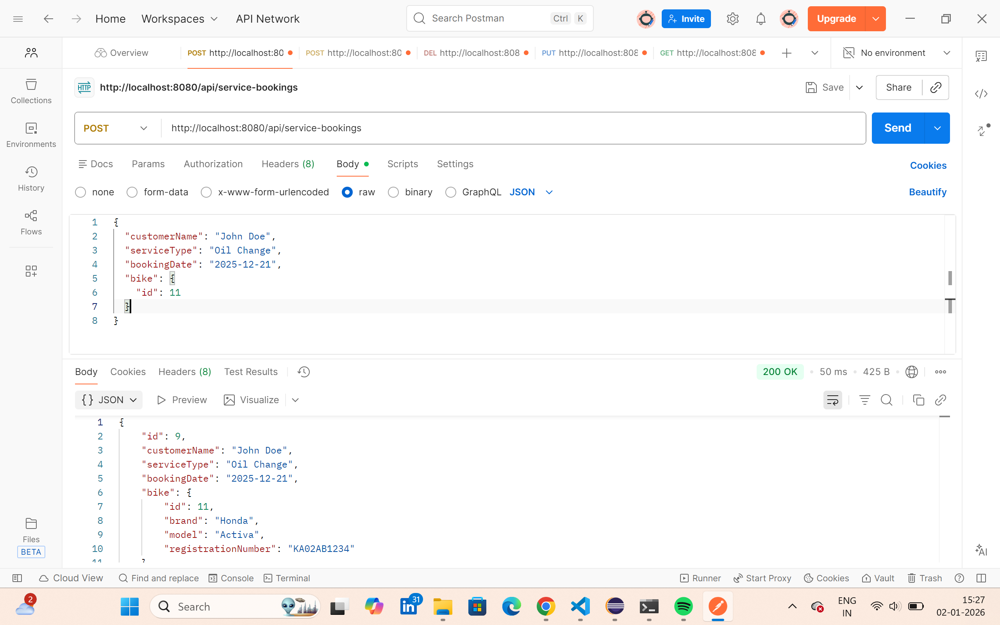

# Bike Service Management - Backend

This is the **backend** for the Bike Service Management application, built using **Spring Boot**, **Java**, and **MySQL**.  
It provides REST APIs for managing bikes and service bookings.

---

## 🛠 Technologies Used
- Java, Spring Boot, Maven
- Spring Data JPA
- MySQL Database

---

## ⚡ Features
1. Add, update, and delete bikes
2. View all bikes
3. Add and view service bookings
4. RESTful APIs for frontend consumption
5. Connected to MySQL database

---

## 🚀 How to Run

1. Open terminal in the backend folder:

```bash
cd bike-service-backend


2. Make sure MySQL is running and credentials in application.properties are correct.

Build and run the project:
mvn clean install
mvn spring-boot:run

Backend runs on: http://localhost:8080
API endpoints example:
GET /api/bikes
POST /api/bikes
PUT /api/bikes/{id}
DELETE /api/bikes/{id}
GET /api/service-bookings
POST /api/service-bookings

## 📸 Screenshots

### Add Bike


### Bike List


### Delete Bike


### Service Bookings


🔗 Related Repos
Frontend: bike-service-frontend

🛠 Challenges & Learnings
Connected Spring Boot with MySQL
Implemented CRUD operations and service booking relations
Solved CORS issues for React frontend integration
